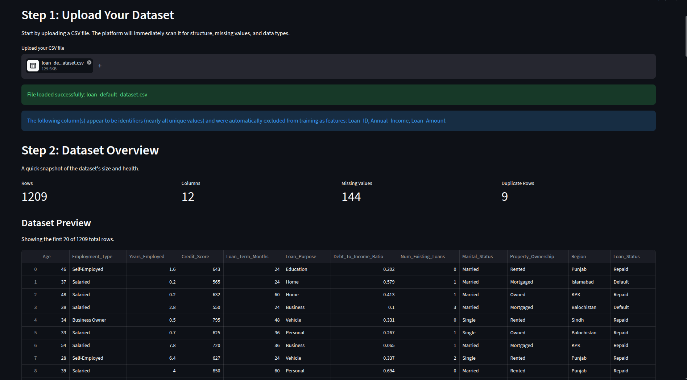
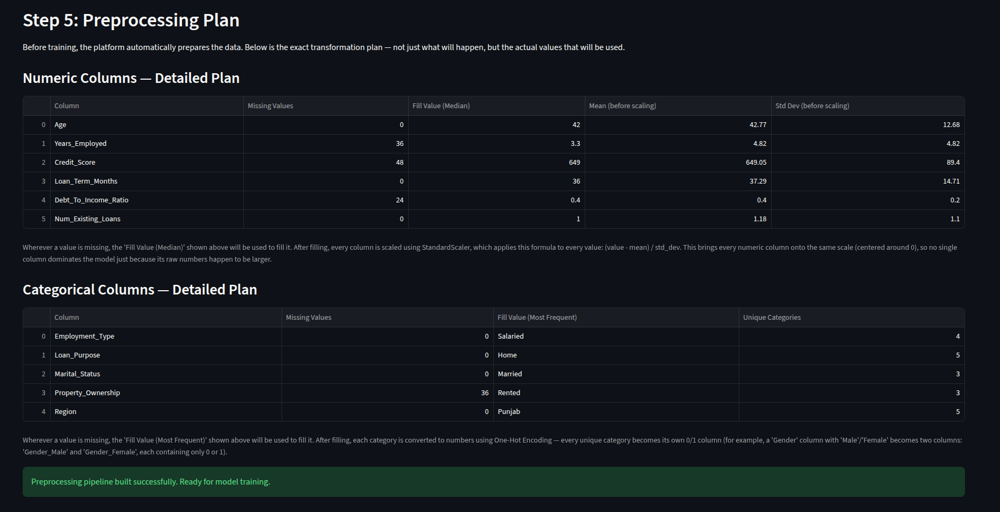
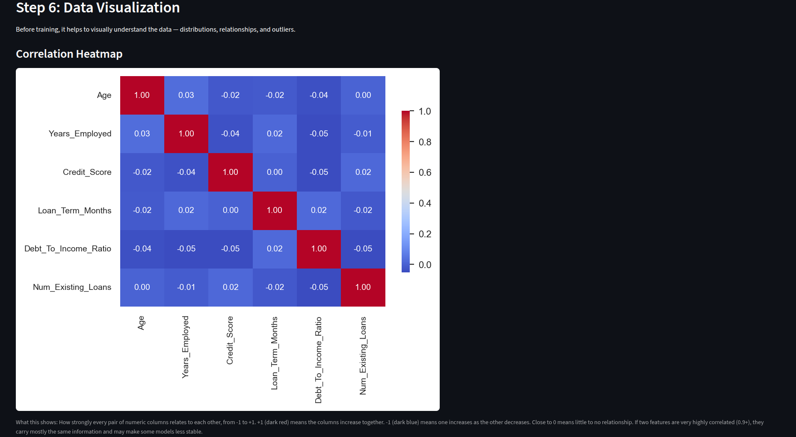
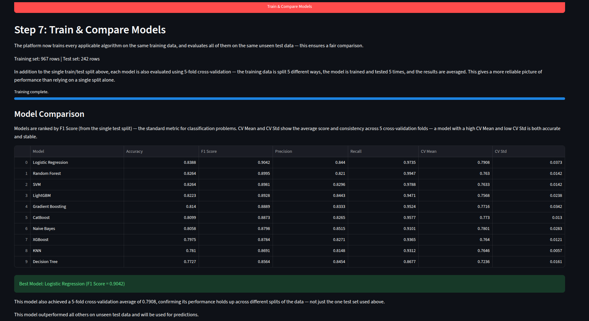
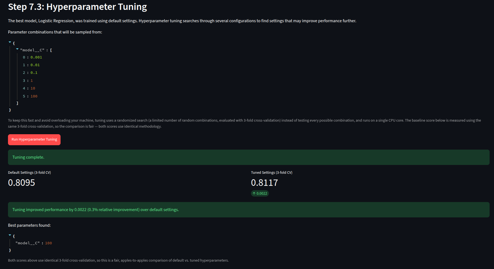

<div align="center">

# ML Pipeline Studio

### From Raw Data to a Validated, Explainable Model — Automatically

[](https://www.python.org/)
[](https://streamlit.io/)
[](https://scikit-learn.org/)
[](https://xgboost.readthedocs.io/)
[](https://lightgbm.readthedocs.io/)
[](https://catboost.ai/)
[](LICENSE)

**Upload any tabular dataset. Nine algorithms are trained, cross-validated, compared,
explained, and the best one is tuned and made ready to predict — with every decision
the platform makes shown in plain language, not hidden behind a score.**

[Why This Exists](#why-this-exists) · [What It Actually Does](#what-it-actually-does) · [Screenshots](#screenshots) · [Installation](#installation) · [Usage](#usage) · [Architecture](#project-structure) · [Roadmap](#roadmap)

</div>

---

## Why This Exists

Most "AutoML" demos are three lines of code around a library, and most beginner ML
projects stop at "I trained a model and got 85% accuracy." Neither actually teaches
the workflow that separates a model that *looks* good from one that *is* good.

This project was built to close that gap — every stage of the pipeline is implemented
from first principles using scikit-learn, and every automated decision is explained
inline: not just *what* the platform did, but *why*.

A few examples of the reasoning baked directly into the app:

- Why a single train/test split can be misleading, and why every model here is also
  evaluated with cross-validation
- Why hyperparameter tuning has to be compared against the *same* evaluation method as
  the baseline — otherwise "improvement" is just measurement noise (this project's own
  early version got this wrong, and the fix is now part of the app itself)
- Why Accuracy alone can hide a model that has learned nothing useful on an imbalanced
  dataset, and why F1 Score is used as the primary classification metric instead
- Why a column with a value that's different in nearly every row is probably an
  identifier, not something worth predicting or training on

---

## What It Actually Does

Given any CSV, the platform runs the same pipeline regardless of subject matter —
medical, financial, operational, or otherwise:

1. **Understands the data** — row/column counts, missing values, duplicates, and
   automatic detection of regression vs. classification based on the target column
2. **Cleans it transparently** — shows the *actual* median/mode values used to fill
   missing data, not just a description of the method
3. **Visualizes it** — correlation heatmap, distributions, boxplots, and category
   counts, each with a plain-language explanation of how to read it
4. **Trains nine algorithms** — Linear/Logistic Regression, Decision Tree, Random
   Forest, KNN, SVM, Gradient Boosting, XGBoost, LightGBM, CatBoost, Naive Bayes
5. **Validates fairly** — every model is scored on a held-out test set *and* 5-fold
   cross-validation, so the ranking isn't the result of one lucky split
6. **Explains the winner** — confusion matrix and per-class report for classification,
   feature importance for tree-based models
7. **Tunes it further** — a randomized hyperparameter search, benchmarked against the
   model's own default performance using identical cross-validation, so the reported
   improvement is real
8. **Predicts on new data** — a single record through an auto-generated form, or a full
   batch through CSV upload

No part of this changes based on what the dataset is about. The same code that
predicts loan defaults or transaction fraud works unmodified on medical outcomes,
salaries, or churn — only the uploaded file changes.

---

## Screenshots

<div align="center">

**Dataset Overview & Data Quality Report**


**Transparent Preprocessing Plan**


**Data Visualization with Explanations**


**Model Comparison with Cross-Validation**


**Prediction Interface**


</div>

---

## Pipeline

```
Upload Dataset
     │
     ▼
Detect Problem Type ── Regression or Classification, with reasoning shown
     │
     ▼
Preprocess Transparently ── exact fill values and scaling shown, not just described
     │
     ▼
Visualize ── correlations, distributions, outliers, category balance
     │
     ▼
Train 9 Models + 5-Fold Cross-Validation ── fair, identical evaluation for every model
     │
     ▼
Select Best Model ── confusion matrix / feature importance
     │
     ▼
Tune the Winner ── randomized search, benchmarked against its own default via matching CV
     │
     ▼
Predict ── single record or batch CSV, using the exact preprocessing learned during training
```

---

## Tech Stack

| Layer | Technology |
|---|---|
| Interface | Streamlit |
| Modeling & Preprocessing | scikit-learn (`Pipeline`, `ColumnTransformer`) |
| Gradient Boosting | XGBoost, LightGBM, CatBoost |
| Data Handling | pandas, NumPy |
| Visualization | Matplotlib, Seaborn |
| Model Tuning | scikit-learn `RandomizedSearchCV` |

---

## Installation

```bash
git clone https://github.com/<your-username>/ml-pipeline-studio.git
cd ml-pipeline-studio

python -m venv venv
source venv/bin/activate        # Windows: venv\Scripts\activate

pip install -r requirements.txt

streamlit run app.py
```

The app opens at `http://localhost:8501`.

---

## Usage

1. Upload a CSV
2. Select the target column — the platform detects and explains whether this is
   regression or classification, and flags likely identifier columns before they
   distort the results
3. Review the preprocessing plan and visualizations
4. Train and compare all nine models, with cross-validation for every one
5. Review the confusion matrix and feature importance for the winning model
6. Optionally run hyperparameter tuning, benchmarked fairly against the default
7. Predict — manually, or by uploading a batch CSV of new records

---

## Example Datasets

Several synthetic datasets were built specifically to exercise different parts of the
pipeline — realistic size, genuine (not random) signal, missing values, duplicates,
and an identifier column to test automatic exclusion:

| Dataset | Domain | Target | Problem Type | Notable Property |
|---|---|---|---|---|
| Loan Default Prediction | Finance | `Loan_Status` | Classification | Demonstrates a real, verified hyperparameter tuning improvement |
| Credit Card Transactions | Finance | `Is_Fraud` | Classification | ~4.5% positive class — shows why Accuracy alone is misleading on imbalanced data |
| Customer Churn | Telecom / SaaS | `Churn` | Classification | Balanced mix of numeric and categorical features |

The same pipeline, without any code changes, also works on regression problems
(salary, house price, insurance premium prediction, and similar).

---

## Evaluation Methodology

| Problem Type | Metrics |
|---|---|
| Regression | R² Score (primary), RMSE, MAE, 5-fold CV mean and standard deviation |
| Classification | F1 Score (primary), Accuracy, Precision, Recall, 5-fold CV mean and standard deviation |

The primary metric determines model ranking, since Accuracy alone can be misleading on
imbalanced datasets — a model that predicts the majority class every time can score
95%+ Accuracy while catching zero cases of the minority class. F1 Score is used to
avoid this trap.

Hyperparameter tuning is benchmarked against the same model's default configuration
using **identical cross-validation**, not a mismatched comparison against a single
train/test split. This was a real bug caught during development of this project — an
earlier version compared a tuned CV score against an untuned single-split score, which
made tuning look like it hurt performance when it hadn't. Fixing this is documented
here deliberately, because catching and correcting evaluation mistakes is as much a
part of doing ML properly as building the pipeline itself.

---

## Project Structure

```
ml-pipeline-studio/
├── app.py                              Orchestrates every stage of the pipeline
├── steps/
│   ├── step1_overview.py                Dataset overview
│   ├── step2_quality.py                 Data quality report
│   ├── step3_target.py                  Target selection + problem-type detection
│   ├── step4_preprocessing.py           Transparent preprocessing plan
│   ├── step_visualization.py            Matplotlib / Seaborn visualizations
│   ├── step6_training.py                Training, cross-validation, comparison
│   ├── step7_prediction.py              Manual and batch prediction
│   ├── step8_confusion_matrix.py        Confusion matrix + classification report
│   ├── step9_feature_importance.py      Feature importance chart
│   └── step_tuning.py                   Fair, CV-benchmarked hyperparameter tuning
├── .streamlit/
│   └── config.toml                      App theme
├── screenshots/
├── requirements.txt
├── LICENSE
└── README.md
```

Each module in `steps/` corresponds to exactly one stage a user sees in the app — the
code structure mirrors how the pipeline is meant to be read, not just executed.

---

## Design Principles

- **Separation of concerns** — UI code never contains modeling logic
- **Fair comparison, always** — identical data splits, identical evaluation
  methodology, whether comparing nine models or comparing default vs. tuned settings
  of one
- **Transparency over black-box output** — every automated decision (imputation
  values, encoding, problem-type detection, identifier exclusion) is shown, not hidden
- **Graceful degradation** — a failing model, a missing optional library, or a
  malformed target column produces a clear message, never a crash

---

## Roadmap

- [ ] Downloadable trained model (`.joblib`)
- [ ] SHAP-based explainability for individual predictions
- [ ] Class imbalance handling (SMOTE)
- [ ] MLflow experiment tracking
- [ ] Public deployment (Streamlit Community Cloud)
- [ ] Docker containerization
- [ ] REST API layer (FastAPI)

---

## Contributing

Issues and pull requests are welcome.

---

## License

[MIT License](LICENSE)

---

## Contact

- LinkedIn: [add your LinkedIn URL]
- GitHub: [add your GitHub profile URL]

<div align="center">

If this project was useful or interesting, consider giving it a star.

</div>